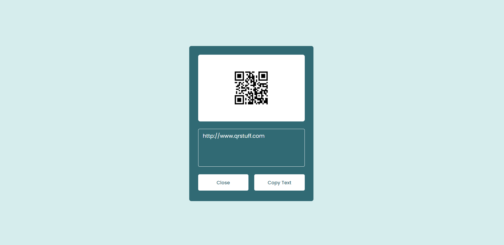

# QR Code Scanner
QR Code Scanner or Reader in HTML CSS &amp; JavaScript | QR Code Scanner in JavaScript.  In this app, users can upload any QR code image and decode/extract the content from it. 
So, the user simply have to get a QR Code and then upload that image into this project and the code will decrypt the QR Code and will display whatever is written inside the QR Code by scanning the image. 
 

## Error Handling
> If the Added image is not a QR Code, the project will display an error message mentionaning that it is not a **Valid QR Code**

## Demo
Visit [This Link](https://rebrand.ly/QrCodeScanner-MABCORP) to test this web app.
 

## Link to Video

 

## GUI

 

## Technology Stack
The technologies used are:
- HTML
- CSS
- JavaScript
- QR Code API Fetcher
 

## Advancement
The functionality after the closing one is not working properly. One has to close the tab twice to use it. So one can fix it by forking.
 

## Developer
Muhammad Abdullah Butt  
abdullahbutt12292210@gmail.com  
> [Instagram](https://www.instagram.com/abdullah.butt.22/) 
> [FaceBook](https://www.facebook.com/profile.php?id=100076291614529) 
> [YouTube](https://www.youtube.com/channel/UCnuOFQyMywg-KuoN-lmav1Q) 
> [Portfolio](https://rebrand.ly/muhammadabdullahPortfolio) 
> [Website](#)
